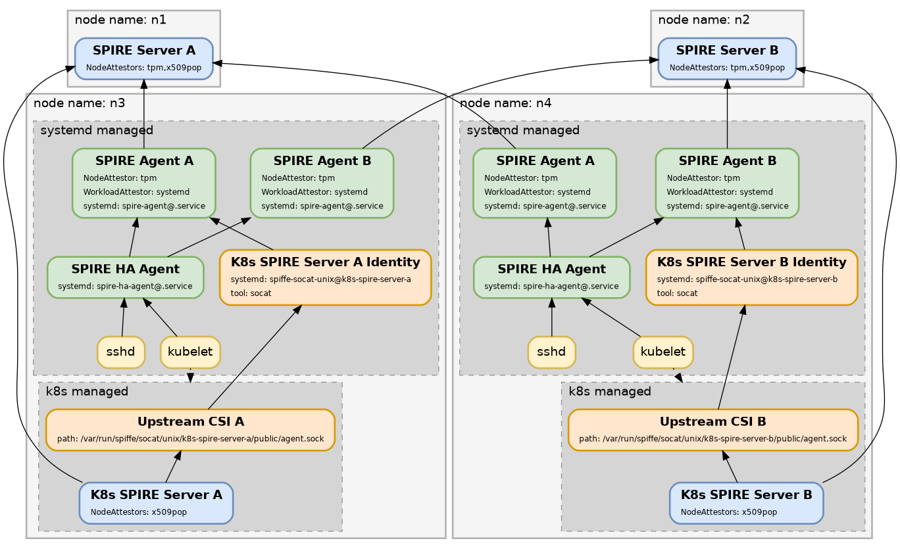
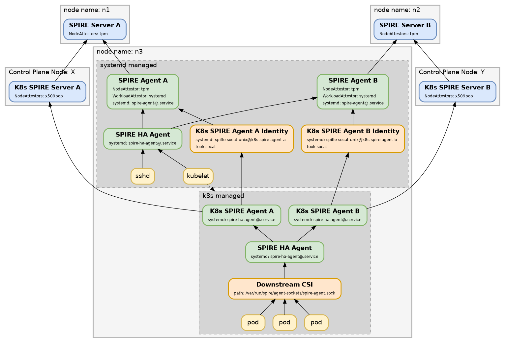

## Kubernetes Bottom Turtle HA Setup

In this setup, a bottom turtle HA setup based on spire-ha-agent and then Kubernetes based access is built from the ground up.

What does this mean?

The bottom turtle:
There is a pair of spire servers deployed. Trust is established between the two servers creating an HA Trust Domain without needing any 3rd party
trust sources.

A spire-ha-agent, a spire-agent@a and a spire-agent@b is run on the k8s hosts. This provides a bottom turtle trust source between the services on the os Kubernetes
runs on.

Host services can then use this trust chain to secure communications such as:
* kubelet -> kube-apiserver
* sshd
* log shipper -> centeralized log processor
* os level metrics
* etc

We will not discuss how to do that here, but need to utilize this base to establish trust inside of Kubernetes.

We will bridge os to Kubernetes cluster with some configuration on the host, and deploying the helm charts to utilize and export new services on top.

What do we need to do?

There are two different kinds of services that need permission bridging.

* SPIRE Servers
* Downstream agents

### Root Servers

Setup a pair of HA root servers as described here:
https://github.com/spiffe/bootc/tree/main/demo

Root Servers, A and B:


### K8s SPIRE Servers

In the following diagram, we see all the parts involved from getting the K8s SPIRE Servers running on the control plane nodes. Note, for diagram simplicity, we wput both spire
servers on the same control plane node. In production, we recommend using antiaffinity to ensure they are always on different nodes.


We need to be able to use the hosts workload attestors to attest the SPIRE Servers running inside Kubernetes.

To do so, we will define a workload on the root spire servers, and inject it into the spire servers inside Kubernetes.

Example workload definition:
```
apiVersion: spire.spiffe.io/v1alpha1
kind: ClusterStaticEntry
metadata:
  name: node1-k8s-spire-server
spec:
  parentID: spiffe://${SPIFFE_TRUST_DOMAIN}/node/node1.${SPIFFE_TRUST_DOMAIN}
  spiffeID: spiffe://${SPIFFE_TRUST_DOMAIN}/k8s-spire-server/server-${SUBINSTANCE}
  downstream: true
  selectors:
  - systemd:id:spiffe-socat-unix@k8s-spire-server-${SUBINSTANCE}.service
  federatesWith:
  - spire-ha
```

And on the host, we install spiffe-socat-unix via packages, and then enable the bridges:
```
spiffe-socat-unix@k8s-spire-server-a.service
spiffe-socat-unix@k8s-spire-server-b.service
```

Any process that can access the unix socket will be able to become a spire downstream server. Treat this socket with great care.

Consider only doing this on your control plane nodes, and restricting the spire-server to only run on the control plane nodes for extra isolation.

### Downstream agents

In the following diagram we show how a worker node is aranged.


We need to be able to use the hosts workload attestors to attest the SPIRE Agents running inside Kubernetes.

To do so, we will define a workload on the root spire servers, and inject it into the spire agents inside Kubernetes.

Example workload definition:
```
apiVersion: spire.spiffe.io/v1alpha1
kind: ClusterStaticEntry
metadata:
  name: node1-k8s-spire-agent
spec:
  parentID: spiffe://${SPIFFE_TRUST_DOMAIN}/node/node1.${SPIFFE_TRUST_DOMAIN}
  spiffeID: spiffe://${SPIFFE_TRUST_DOMAIN}/spire-exchange/node1.${SPIFFE_TRUST_DOMAIN}
  selectors:
  - systemd:id:spiffe-socat-unix@k8s-spire-agent-${SUBINSTANCE}.service
  federatesWith:
  - spire-ha
```

And on the host, we install spiffe-socat-unix via packages, and then enable the bridges:
```
spiffe-socat-unix@k8s-spire-agent-a.service
spiffe-socat-unix@k8s-spire-agent-b.service
```

## Install the charts:

We need to install 4 charts.

* spire crds
* side A
* side B
* the common infrasctructure

This allows upgrading Side A or Side B completely independencly from each other, ensuring if there is a problem it will not affect production.

FIXME

