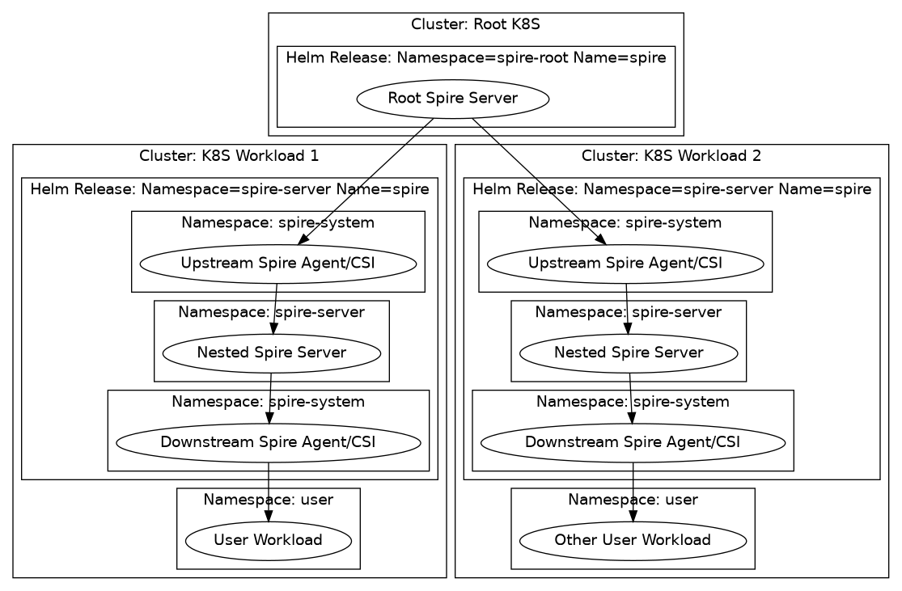
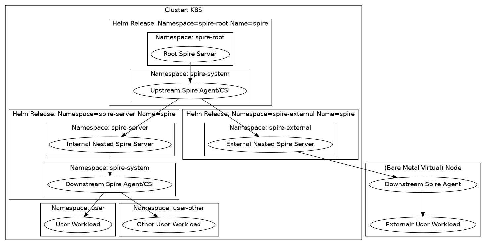

# Possible Nesting Configurations

There are multiple ways of configuring the chart depending on what you want to use nesting for.

## Nesting across Kubernetes clusters:

## Nesting within a Kubernetes cluster:

